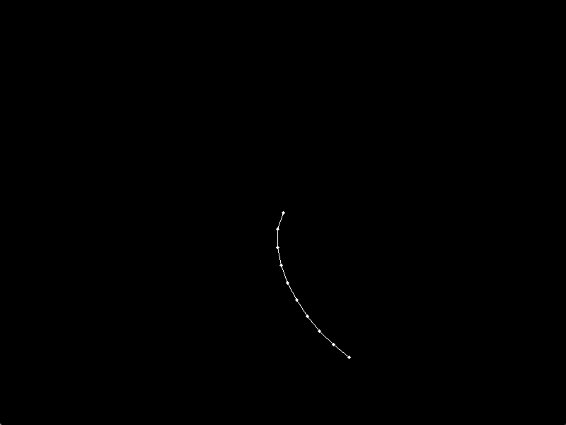

_ggl_ is a game library for Go, based on SDL. It's meant to have a really simple API - here's an example:

```go
package main

import (
    "github.com/Zac-Garby/ggl/colour"
	"github.com/Zac-Garby/ggl/geom"
	"github.com/Zac-Garby/ggl/window"
)

func main() {
    win, err := window.Default.Make()
    if err != nil {
        panic(err)
    }

    defer win.Close()

    win.Render = func() {
        rect := geom.NewRect(50, 50, 200, 25)
        win.Fill().Colour(colour.Red).Rect(rect)
    }

    win.Loop()
}
```

Have a look in `/example` for some more interesting ones.



## Features

Currently implemented:

 - Simplified window creation
   - Windows are customizable via configs
 - Chainable rendering API
   - Rectangles, circles, lines, polygons, etc...
 - Lower level access to SDL window and renderer for more control
 - Fast, GPU accelerated rendering
 - Event handling (raw SDL events)

What isn't implemented yet, but will be soon:

 - **Documentation**
 - An event wrapper type
 - Store currently pressed keys and mouse buttons in the window for querying
 - Asset loading (async/sync)
 - Sprites
 - Sounds
 - Text rendering, fonts

What might be added in the future:

 - Shaders
 - Tilemap importing
 - Physics (box2d?)
 - A TCP game server/client
